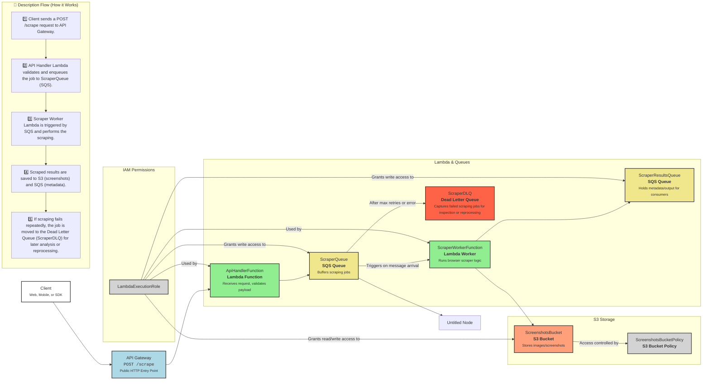

# Wikipedia Scraper Backend

A scalable TypeScript backend for scraping web pages, taking screenshots, and storing them in AWS S3. The application is built with Express, TypeScript, and can be deployed as a serverless function on AWS Lambda.

## Features

- 🚀 Scrape pages with Puppeteer
- 📸 Take full-page screenshots
- ☁️ Store screenshots in AWS S3
- 📝 API documentation with Swagger
- 🔒 Input validation with Zod
- 🛡️ Security best practices (Helmet, rate limiting, CORS)
- 📦 AWS Lambda ready
- 🐳 Docker support for local development

## Prerequisites

- Node.js 18.x or later
- pnpm 8.x or later
- AWS Account with appropriate permissions
- AWS CLI configured with credentials
- Docker (for local testing with AWS SAM)

## Getting Started

### 1. Clone the repository

```bash
git clone https://github.com/yourusername/wiki-scraper-backend.git
cd wiki-scraper-backend
```

### 2. Install dependencies

```bash
pnpm install
```

### 3. Set up environment variables

Copy the example environment file and update the values:

```bash
cp .env.example .env
```

Edit the `.env` file with your AWS credentials and other configuration.

### 4. Local Development (Lambda and API Gateway)

Start the local AWS SAM API Gateway with hot-reload for Lambda functions (little complex):

For local development and testing with AWS SAM, we leverage Docker containers to create an isolated Lambda-like environment. This approach provides a consistent development experience across different machines while simulating AWS services locally. The setup involves several key components:

1. Docker installed and running
2. AWS SAM CLI installed
3. Docker network configured for local development

The local setup uses:
- `template.local.yaml` for local development configuration
- Docker containers to simulate AWS services
- Hot-reload for faster development cycles

For detailed setup instructions, refer to the [AWS SAM Local Setup Guide](https://awsforengineers.com/blog/aws-sam-local-setup-guide/).


```bash
sudo pnpm local:api
```

The API will be available at `http://localhost:3000`

### 5. Local Development (Express Backend)

Start the Express development server with hot-reload:

```bash
pnpm dev
```

The API will be available at `http://localhost:3000` (from `template.local.yaml`)

### 6. Build for Production

```bash
pnpm build
```

## Available Scripts

- `pnpm dev` - Start the Express development server with hot-reload
- `pnpm start` - Start the Express production server
- `pnpm build` - Build the application for production
- `pnpm test` - Run tests
- `pnpm lint` - Lint the code
- `pnpm format` - Format the code
- `pnpm lambda:build` - Build the Lambda deployment package (runs `deploy.sh`)
- `pnpm lambda:deploy` - Deploy the SAM application to AWS
- `pnpm lambda:deploy:guided` - Deploy the SAM application to AWS with guided prompts
- `pnpm local:api` - Start local API Gateway for Lambda development using SAM
- `pnpm local:invoke` - Invoke a local Lambda function with a test event using SAM

## AWS Architecture Diagram

Here is an overview of the AWS architecture for this application:



## Configurable Scraping Enhancements

This application is designed with extensibility in mind to support advanced web scraping needs. Future enhancements can be easily integrated and configured to handle more complex scenarios:

-   **Proxy Integration:** Configure the Puppeteer scraper to route requests through various proxy services. This helps in rotating IP addresses, bypassing geo-restrictions, and avoiding IP bans.
-   **Bot Prevention Bypasses:** Implement strategies to overcome bot detection mechanisms, such as adjusting browser fingerprints, handling reCAPTCHA, and simulating human-like browsing patterns.
-   **CAPTCHA Solvers:** Integrate with third-party CAPTCHA solving services to automate the resolution of CAPTCHAs encountered during scraping.

## Project Structure

```
src/
├── config/           # Configuration files
├── controllers/       # Request handlers
├── middlewares/       # Express middlewares
├── models/            # Data models
├── routes/            # Route definitions
├── services/          # Business logic
├── types/             # TypeScript type definitions
├── utils/             # Utility functions
├── app.ts             # Express application setup
├── index.ts           # Application entry point
└── lambda.ts          # AWS Lambda handler (Note: currently not used in SAM deployment)
```

## Deployment

For detailed deployment instructions, including building the Lambda package and deploying with AWS SAM, please refer to the [DEPLOYMENT.md](DEPLOYMENT.md) guide.

## Environment Variables

| Variable | Description | Default |
|----------|-------------|---------|
| NODE_ENV | Node environment | `development` |
| PORT | Port to run the server | `3001` |
| AWS_ACCESS_KEY_ID | AWS access key ID | - |
| AWS_SECRET_ACCESS_KEY | AWS secret access key | - |
| AWS_REGION | AWS region | `ap-south-1` |
| S3_BUCKET_NAME | S3 bucket name for screenshots | - |
| S3_SIGNED_URL_EXPIRY | Expiry time for S3 signed URLs (seconds) | `3600` |
| CORS_ORIGIN | Allowed CORS origins | `*` |
| LOG_LEVEL | Logging level | `info` |
| LOG_DIR | Directory for log files | `logs` |
| RATE_LIMIT_MAX | Maximum requests per window | `100` |
| RATE_LIMIT_WINDOW_MS | Rate limit window in milliseconds | `900000` (15 minutes) |

## API Endpoints

### Scrape Endpoint

**POST** `/api/scrape`

Accepts either a single scraping job object or an array of scraping job objects. Each job specifies a `site_type` (e.g., `wikipedia`, `news`), `user_id`, `url`, and optional `metadata`.

#### Single Job Request Example
```json
{
  "site_type": "wikipedia",
  "user_id": "hell0123",
  "url": "https://nextjs.org/docs/app/building-your-application/routing/middleware",
  "metadata": {
      "source": "api-gateway",
      "priority": "high"
  }
}
```

#### Batch Job Request Example
```json
[
  {
      "site_type": "wikipedia",
      "user_id": "user1",
      "url": "https://en.wikipedia.org/wiki/Node.js",
      "metadata": {
          "source": "api-gateway",
          "priority": "high"
      }
  },
  {
      "site_type": "news",
      "user_id": "user2",
      "url": "https://www.cnn.com/",
      "metadata": {
          "source": "api-gateway",
          "priority": "low"
      }
  }
]
```

#### Example cURL Commands

**Single Job:**
```sh
curl -X POST http://localhost:3000/api/scrape \
  -H "Content-Type: application/json" \
  -d '{ "site_type": "wikipedia", "user_id": "hello1234", "url": "https://nextjs.org/docs/app/building-your-application/routing/middleware", "metadata": { "source": "api-gateway", "priority": "high" } }'
```

**Batch Jobs:**
```sh
curl -X POST http://localhost:3000/api/scrape \
  -H "Content-Type: application/json" \
  -d '[
    { "site_type": "wikipedia", "user_id": "user1", "url": "https://en.wikipedia.org/wiki/Python", "metadata": { "source": "api-gateway", "priority": "high" } },
    { "site_type": "news", "user_id": "user2", "url": "https://www.cnn.com/", "metadata": { "source": "api-gateway", "priority": "low" } }
  ]'
```

- Each job result includes `success`, `data` (on success), or `error` (on failure).
- The `screenshotKey` is a public S3 URL to the screenshot.
- The `markdown` and `links` fields contain extracted content.

---

For more details, see the code in `src/app.ts`, `src/types/scrape.types.ts`, and the scrapers in `src/scraper/`.

## Express API Flow

This section describes the flow of a request through the Express.js backend:

1.  **Entry Point (`src/index.ts`):** The application starts here, setting up the Express app and listening for incoming HTTP requests.
2.  **Express Application (`src/app.ts`):** This file configures the core Express application, including:
    *   **Middleware:** Applies global middleware for security (Helmet), CORS, JSON parsing, compression, and request logging.
    *   **Routes:** Integrates the API routes defined in `src/routes/index.ts`.
    *   **Error Handling:** Sets up global error handling middleware (`src/middlewares/error.ts`).
3.  **Routing (`src/routes/index.ts` and `src/routes/*.ts`):** Defines the API endpoints. Requests are directed to specific controllers based on the route path and HTTP method.
4.  **Controllers (`src/controllers/*.ts`):** Handle incoming requests and prepare responses. Controllers are kept lean; they primarily:
    *   Parse and validate request data.
    *   Delegate business logic to appropriate services.
    *   Format the response.
5.  **Validation (`src/validations/*.ts`):** Zod schemas are used to validate request bodies and query parameters, ensuring data integrity. This often happens within middleware or directly in controllers.
6.  **Services (`src/services/*.ts`):** Contain the core business logic. Services are decoupled from the HTTP layer, making them reusable and testable. For scraping tasks, services will typically interact with:
    *   **SQS:** To queue scraping jobs for asynchronous processing by Lambda workers.
    *   **S3:** For direct storage/retrieval of data, such as screenshots.
7.  **Utilities (`src/utils/*.ts`):** Provides common utility functions, such as logging (`src/utils/logger.ts`) and S3 interactions (`src/utils/s3-helper.ts`).

## Monitoring and Logging

- **Local Logs**: Logs are written to the `logs/` directory
- **CloudWatch Logs**: When deployed to AWS, logs are available in CloudWatch

## Security

- Input validation with Zod
- Helmet for security headers
- Rate limiting
- CORS protection
- Environment-based configuration
- No sensitive data in version control

## Contributing

1. Fork the repository
2. Create your feature branch (`git checkout -b feature/AmazingFeature`)
3. Commit your changes (`git commit -m 'Add some AmazingFeature'`)
4. Push to the branch (`git push origin feature/AmazingFeature`)
5. Open a Pull Request

## License

This project is licensed under the MIT License - see the [LICENSE](LICENSE) file for details.

## Acknowledgments

- [Express](https://expressjs.com/)
- [TypeScript](https://www.typescriptlang.org/)
- [Puppeteer](https://pptr.dev/)
- [AWS SDK v3](https://aws.amazon.com/sdk-for-javascript/)
- [Zod](https://zod.dev/)
- [Swagger](https://swagger.io/)
